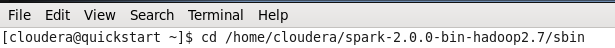
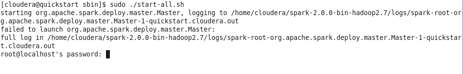
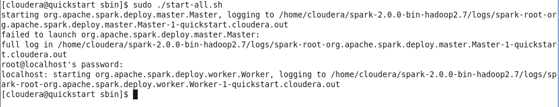
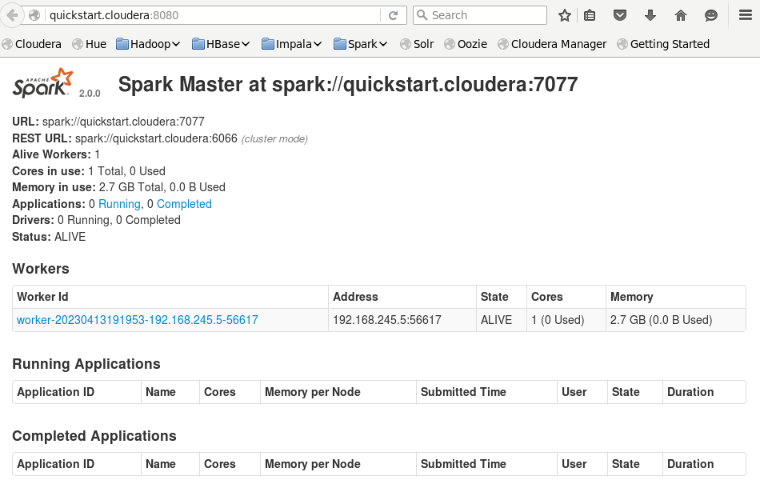

Tugas Praktikum Individu Big data 
Nama  : Farah Zulfa Hamidah 
Absen : 07 
Kelas : TI-3B 

# Bagian 1 spark-sql-big-data
## Analitik dengan DataFrames
----------------------------------------------------

## 1. akses ke folder spark di mana Anda pernah ekstrak sebelumnya
  

## 2. running
  

## 3. mengisikan password dengan cloudera
  

## 4. mengakses di browser CDH atau VM pada alamat http://quickstart.cloudera:8080/
  

# Bagian 2 spark-sql-big-data/01_dataframes
## Membuat DataFrames
----------------------------------------------------

