Tugas Praktikum Individu Big data 
Nama  : Farah Zulfa Hamidah 
Absen : 07 
Kelas : TI-3B 

# Bagian 1 spark-sql-big-data
## Analitik dengan DataFrames
----------------------------------------------------

## Akses ke folder spark di mana Anda pernah ekstrak sebelumnya
  

## Running
  

## Mengisikan password dengan cloudera
  

## Mengakses di browser CDH atau VM pada alamat http://quickstart.cloudera:8080/
  

# Bagian 2 spark-sql-big-data/01_dataframes
## Membuat DataFrames
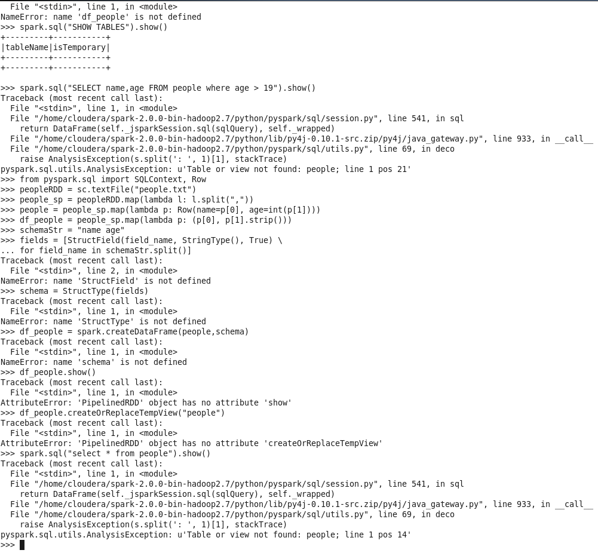  

## Membuat DataFrame dari Database Eksternal / DBs
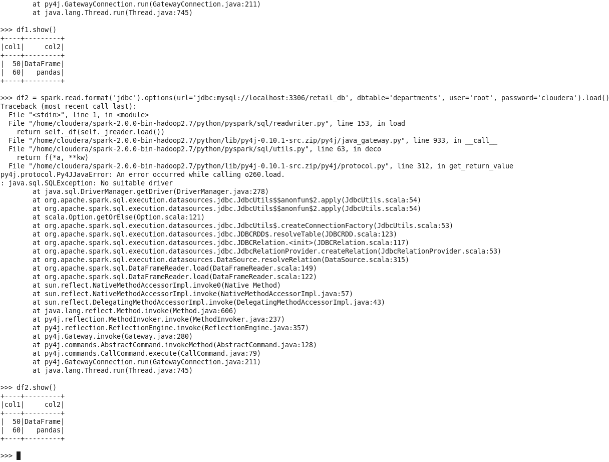  

## Membuat DataFrame dari Hive
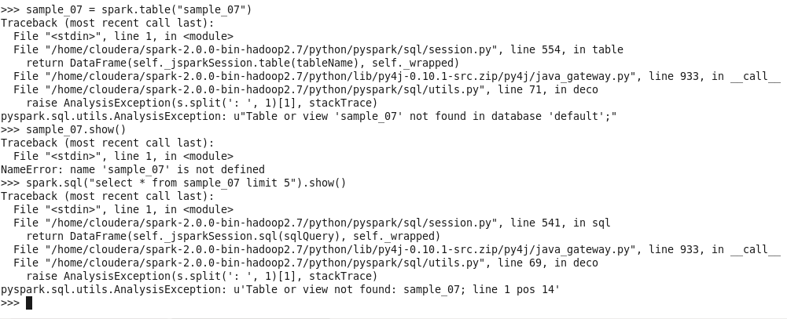  

## Mengonversi DataFrames ke RDDs
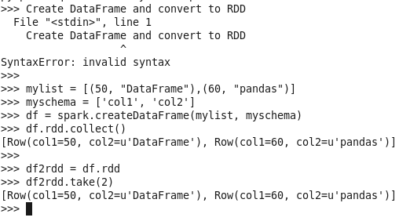  

## Membuat Datasets
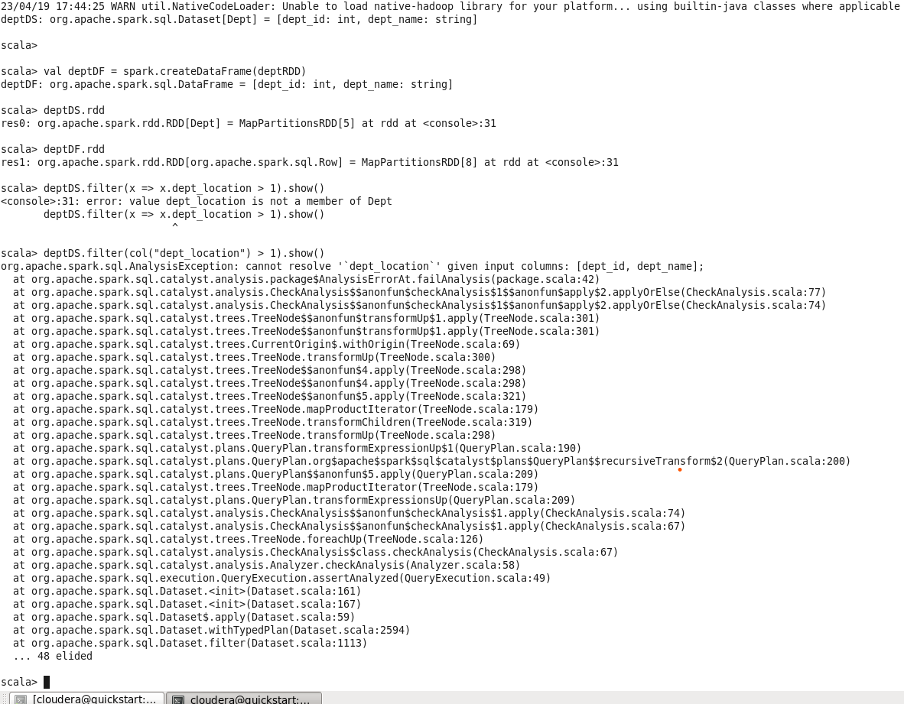  

## Mengakses pandas DF2 DataFrame
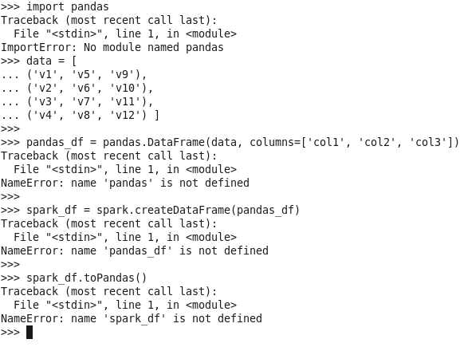  

## Mengakses Metadata menggunakan Catalog
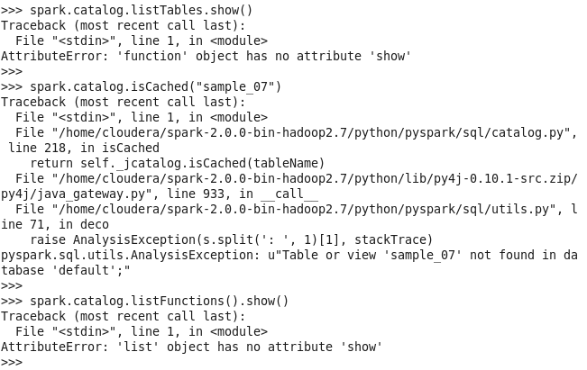  

## Bekerja dengan berkas teks
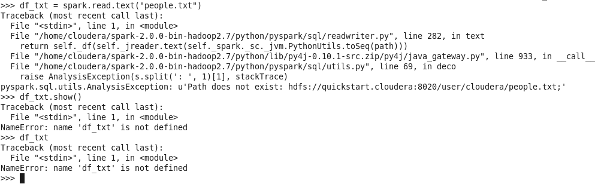  

## Bekerja dengan JSON
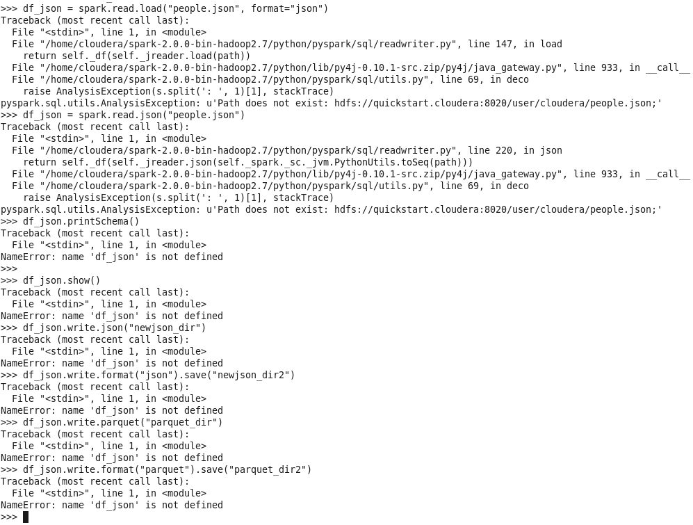  

## Bekerja dengan CSV
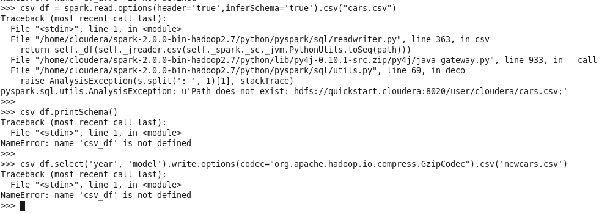  

## Bekerja dengan AVRO
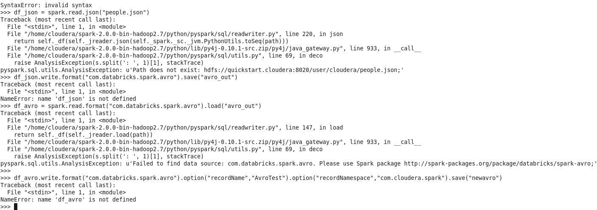  

## Bekerja dengan JDBC
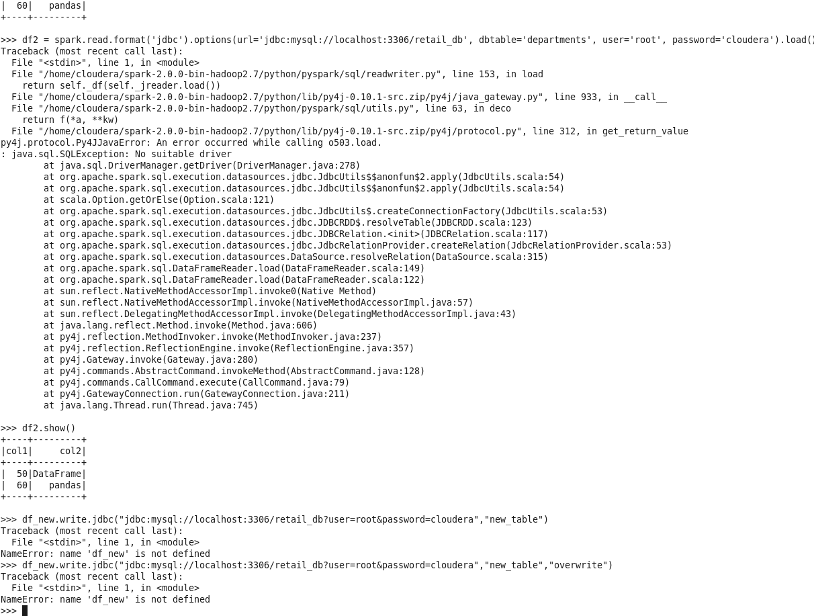  

## Bekerja dengan ORC
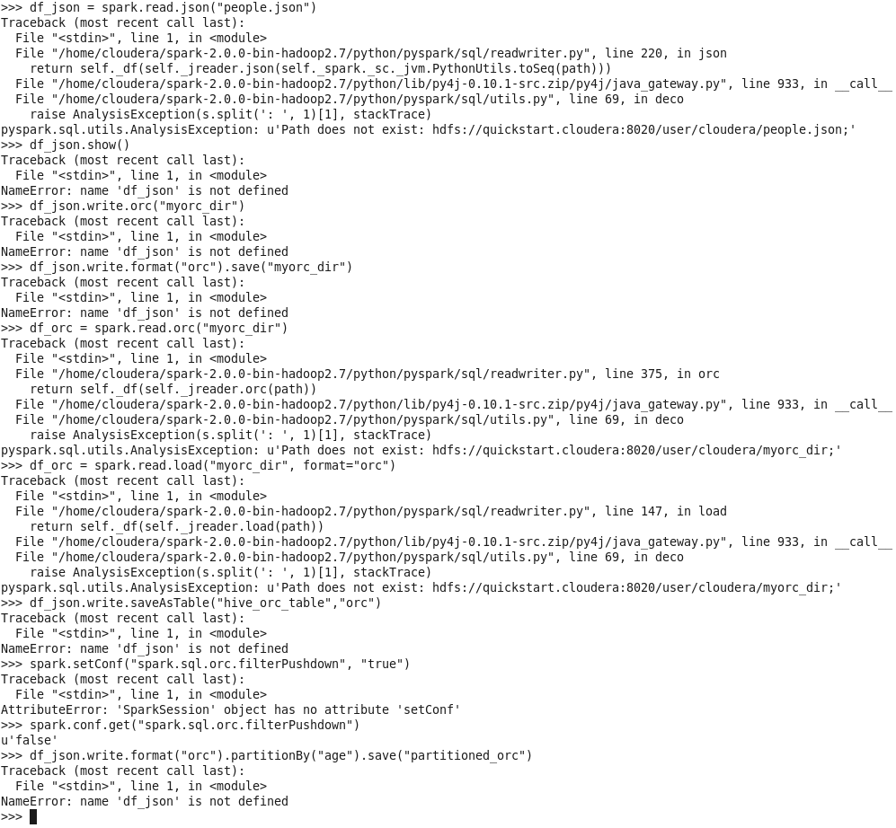  

## Bekerja dengan Parquet
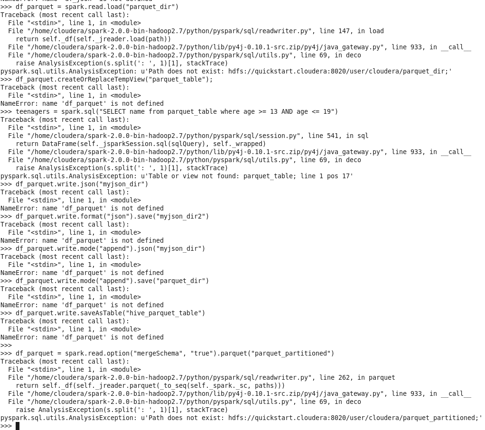  

## Bekerja dengan XML
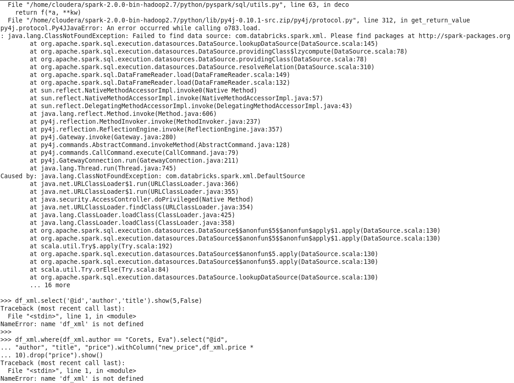  

## Mengakses SparkOnHBaseConnector
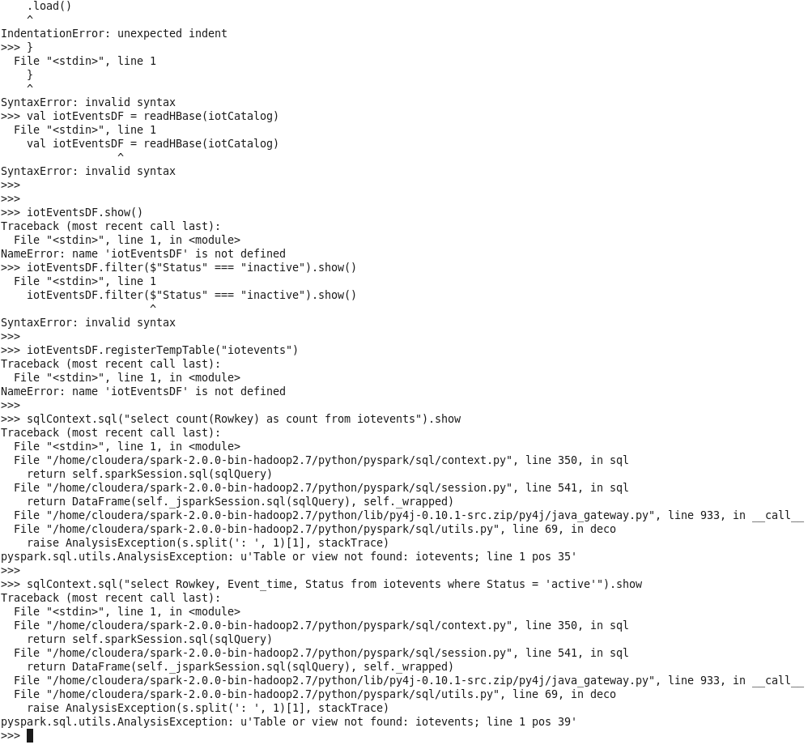  

# Bagian 3 Tugas Praktikum Penjelasan Kode Program  
1.	mylist, myschema: Ini adalah dua variabel yang digunakan untuk menyimpan daftar data dan skema data secara berturut-turut.

2.	spark.createDataFrame: Ini adalah fungsi yang digunakan untuk membuat DataFrame baru dalam Spark.

3.	parallelize, toDF: parallelize adalah fungsi yang digunakan untuk membuat RDD baru dari daftar objek, sedangkan toDF adalah fungsi yang digunakan untuk mengubah RDD menjadi DataFrame.

4.	hadoop, fs, put: Ini adalah perintah yang digunakan dalam Hadoop untuk menyalin file dari lokal ke sistem file Hadoop.

5.	pyspark.sql, SQLContext, createOrReplaceTempView, show: Ini adalah fungsi-fungsi dalam PySpark SQL yang digunakan untuk membuat konteks SQL, membuat tampilan sementara, dan menampilkan DataFrame.

6.	textFile, map, lambda, strip, StructField, StringType: textFile adalah fungsi yang digunakan untuk membaca file teks dalam RDD, map dan lambda adalah fungsi yang digunakan untuk menerapkan transformasi pada setiap elemen RDD, strip adalah fungsi yang digunakan untuk menghapus karakter spasi di sekitar string, sedangkan StructField dan StringType adalah kelas yang digunakan untuk menentukan skema DataFrame.

7.	spark.read.format, jdbc, options, load: Ini adalah fungsi-fungsi dalam Spark SQL yang digunakan untuk membaca data dari sumber eksternal seperti basis data JDBC dengan menggunakan format yang ditentukan dan opsi konfigurasi.

8.	show: Ini adalah fungsi yang digunakan untuk menampilkan DataFrame.

9.	collect, rdd, take: collect adalah fungsi yang digunakan untuk mengumpulkan semua elemen RDD ke dalam variabel driver, sedangkan rdd adalah kelas yang merepresentasikan Resilient Distributed Dataset, dan take adalah fungsi yang digunakan untuk mengambil sejumlah elemen dari RDD.

10.	makeRDD, Seq, createDataset: makeRDD adalah fungsi yang digunakan untuk membuat RDD baru dari sebuah koleksi, Seq adalah kelas koleksi urutan dalam Scala, sedangkan createDataset adalah fungsi yang digunakan untuk membuat dataset baru dari RDD.

11.	filter: Ini adalah fungsi yang digunakan untuk memfilter elemen RDD berdasarkan kondisi yang ditentukan.

12.	as, toDF, first: as adalah fungsi yang digunakan untuk mengubah nama kolom DataFrame, toDF adalah fungsi yang digunakan untuk mengubah RDD menjadi DataFrame, dan first adalah fungsi yang digunakan untuk mengambil nilai pertama dari RDD.

13.	listDatabases, listTables, listFunctions, isCached, select: Ini adalah fungsi-fungsi dalam Spark SQL yang digunakan untuk menampilkan daftar basis data, tabel, dan fungsi, memeriksa apakah DataFrame telah disimpan dalam cache, serta memilih dan memproyeksikan kolom DataFrame.

14.	Read, text: Read adalah fungsi dalam Spark SQL yang digunakan untuk membaca data dari sumber eksternal, sedangkan text adalah format data yang digunakan untuk membaca file teks.

15.	load, json, format, printSchema: load adalah fungsi yang digunakan untuk membaca data dari sumber eksternal dengan format yang ditentukan, json adalah format data yang digunakan untuk membaca file.

16.	write, save: write adalah fungsi dalam Spark SQL yang digunakan untuk menyimpan DataFrame ke dalam sumber eksternal dengan format yang ditentukan, sedangkan save adalah alias dari write. Kedua fungsi ini sama-sama digunakan untuk menyimpan DataFrame ke dalam file.

17.	parquet: Ini adalah format data untuk menyimpan data tabular dengan efisiensi kompresi yang tinggi dalam Hadoop. Format ini digunakan dalam Spark untuk menyimpan DataFrame dengan efisiensi penyimpanan dan performa yang lebih baik dibandingkan dengan format lainnya.

18.	Options: Parameter ini digunakan untuk menyediakan konfigurasi tambahan saat membaca data. Misalnya, dapat digunakan untuk memberikan konfigurasi khusus pada sumber data yang dibaca, seperti delimiter, quote character, atau karakter escape.

19.	inferSchema: Parameter ini digunakan untuk menentukan apakah skema DataFrame harus diinfer dari data sumber atau ditentukan secara eksplisit oleh pengguna.

20.	csv: Parameter ini menunjukkan bahwa format sumber data adalah dalam format CSV.

21.	header: Parameter ini menunjukkan bahwa sumber data memiliki baris header, yang akan digunakan sebagai nama kolom DataFrame.

22.	codec: Parameter ini digunakan untuk menentukan codec yang digunakan saat membaca data dari sumber. Hal ini dapat digunakan untuk membaca data yang dienkripsi atau dikompresi.
